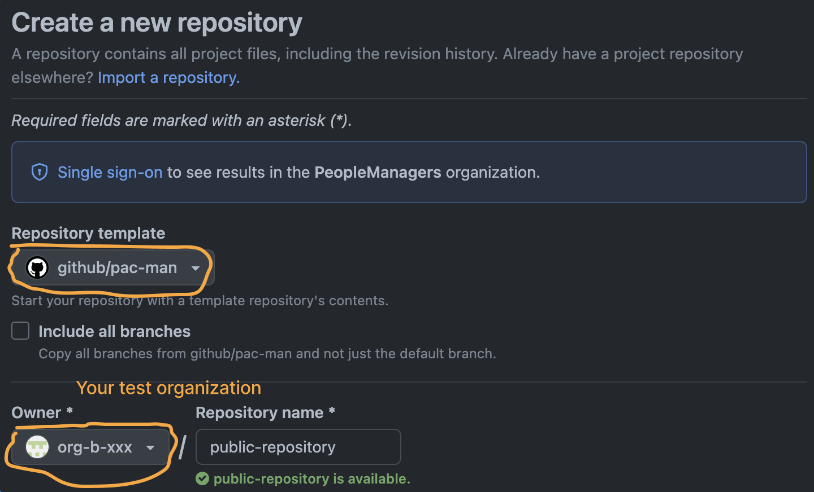

# Pac-Man 2

Pac-Man is a [template repository](https://docs.github.com/en/repositories/creating-and-managing-repositories/creating-a-template-repository) containing a collection of Actions workflows that help you to generate usage of GitHub metered products.

# Usage

First, create a Pac-Man repository in your organization. You can use any name for the repository.

1. Open the organization where you want to generate the usage
1. Navigate to the _Repositories_ tab
1. Click _New repository_
1. In the _Repository template_ field, select _github/pac-man_
1. If the _Owner_ field is set to _github_, set it back to your organization
1. Fill in the remaining fields to suit your needs
1. Click _Create repository_

Next, you can run the Actions coming with Pac-Man to generate usage. The following example is to generate Actions `macos-latest` usage.

1. Open the Pac-Man repository created in previous step
1. Navigate to the _Actions_ tab
1. In the left panel, click on _actions_
1. In the right panel, click on the _Run workflow_ button
1. Select SKU `macos-latest`
1. Enter the desired amount of minutes to generate
1. Click _Run workflow_

# Updates

We are continuously pushing fixes and improvements to this template repository. To get the latest updates in your Pac-Man repository, simply delete it, and start all over.

# Contributing

All welcome. Pull-request not required. You can test your changes by running Actions on the template repository itself.

# Pac-Man 1

The previous version can be found in [pac-man.yml](https://github.com/github/gitcoin/blob/main/utilities/pac-man.yml). Once we port all products from Pac-Man 1, we'll deprecate it.